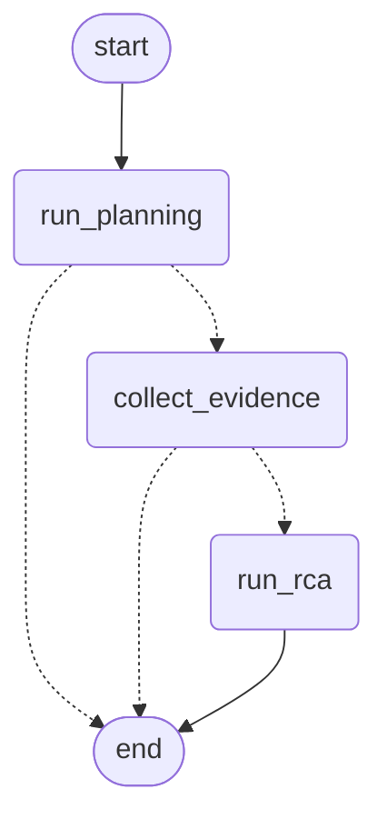

# AIR Agent App

Python incident-planning MVP built with LangChain, LangGraph, FastAPI, and
Pydantic. This implements Section 1 of the AIR Agentic SRE Implementation
Guide (`reference/AIR_Agentic_SRE_Implementation_Guide.pdf`) - the
Investigation Planner - plus three evidence specialists the guide defines
(**LogsAgent**, **MetricsAgent**, **DeploymentAgent**, Sections 4-6) and one
it doesn't (**TracesAgent**, a local extension - see
`docs/extension_01_traces_agent.md`). See
`docs/section_03_evidence_collection_plan.md` for the plan and how it
relates to `reference/Context_Engineering_Context_Rot.ipynb`.

## Setup

```bash
python3 -m venv .venv
source .venv/bin/activate
python -m pip install -e '.[dev]'
```

## Planner commands

The planner makes one logical model-generation call and ends through one of two
paths: `PLAN_READY` or `PLANNER_FAILED`.

```bash
python -m air_agent_app.commands.planner --scenario ready
python -m air_agent_app.commands.planner --scenario no-agents
python -m air_agent_app.commands.validate_plan_contract
```

For live planning:

```bash
export OPENAI_API_KEY="your-openai-key"
export AIR_MODEL_NAME="your-enabled-model-name"
python -m air_agent_app.commands.planner --live
```

The graph accepts a structured plan when `parallel_agents` is nonempty. Empty
agents produce `NO_AGENTS_SELECTED`. Provider and structured-output failures
produce `MODEL_FAILURE`. There is no graph-level readiness, review, enrichment,
retry, or planning retry loop — this is a single-attempt planning call.

## FastAPI

```bash
python -m uvicorn air_agent_app.api.app:create_app --factory --host 127.0.0.1 --port 8000
```

POST incidents to `/api/v1/planning` or open http://127.0.0.1:8000/docs.
A sample request body is at `docs/requests/section_01_planning_incident.json`.

CORS is enabled for `air-ui-app`'s local Vite dev server
(`http://localhost:5175` and `http://127.0.0.1:5175` by default - browsers
treat the two host forms as different origins). For any other UI origin
(a different dev port, or a deployed UI), set `AIR_UI_ORIGINS` to a
comma-separated list before starting the server, e.g.
`AIR_UI_ORIGINS=https://air-ui.example.com`. Without a matching origin,
the browser's OPTIONS preflight for a JSON POST gets no
`access-control-*` headers back and blocks the request before it's even
sent - a backend config issue, not something fixable from the UI side.

## Log evidence

Once a plan is `PLAN_READY` with `LogsAgent` among `parallel_agents`, collect
its evidence:

```bash
curl -X POST http://127.0.0.1:8000/api/v1/evidence/logs \
  -H 'content-type: application/json' \
  -d '{
    "investigation_id": "8e9c44cd-43ef-4a8e-ae4e-06b05714ca09",
    "service_name": "payment-service",
    "environment": "production",
    "start_time": "2026-08-29T14:00:00Z",
    "end_time": "2026-08-29T16:00:00Z",
    "required_evidence": ["Application exceptions"]
  }'
```

There is no live log-platform adapter yet, so this always runs against a
deterministic offline log dump (`tools/mock/fixtures/log_dump.py`) - the same
payment-service / `upstream_connect_timeout` scenario used in
`reference/Context_Engineering_Context_Rot.ipynb`, now found by counting
instead of by an LLM reading a 1,500-line dump. No persistence: the endpoint
does not check that a plan was actually generated for `investigation_id`,
since no investigation state is stored server-side.

## Metric evidence

Same idea, for runtime-health signals, with `MetricsAgent` among
`parallel_agents`:

```bash
curl -X POST http://127.0.0.1:8000/api/v1/evidence/metrics \
  -H 'content-type: application/json' \
  -d @docs/requests/section_05_metrics_evidence_request.json
```

Also offline-only today (`tools/mock/fixtures/metric_series.py`). Every
metric is compared against a baseline window (Section 5.5): CPU/memory stay
healthy for `payment-service`, while `http_5xx_rate` and `p95_latency_ms`
are flagged `UNHEALTHY`, matching the guide's own Section 5.6 example
exactly. Request `service_name: "cache-service"` instead to see the
notebook's decoy - a real, `UNHEALTHY` memory climb that has nothing to do
with the payment-service incident; see
`docs/section_05_metrics_agent.md` for why that matters.

## Trace evidence

A third specialist, `TracesAgent` - not one of the guide's own four evidence
agents, a local addition following the same pattern (see
`docs/extension_01_traces_agent.md`):

```bash
curl -X POST http://127.0.0.1:8000/api/v1/evidence/traces \
  -H 'content-type: application/json' \
  -d @docs/requests/extension_01_traces_evidence_request.json
```

Also offline-only (`tools/mock/fixtures/trace_dump.py`), continuing the same
payment-service scenario: the same 5 buried requests that LogsAgent finds as
log errors show up here as slow, erroring spans in the
`call_payment_processor` step of the call chain - the same root cause, seen
from a third angle.

## Deployment evidence

A fourth specialist - `DeploymentAgent`, the guide's actual Section 6, GitHub
and change evidence - with `DeploymentAgent` among `parallel_agents`:

```bash
curl -X POST http://127.0.0.1:8000/api/v1/evidence/deployments \
  -H 'content-type: application/json' \
  -d @docs/requests/section_06_deployment_evidence_request.json
```

Also offline-only (`tools/mock/fixtures/deployment_dump.py`), encoding the
notebook's own STEPS list verbatim: `payment-service` deployed v2.4.1 two
hours before the incident - the exact deployment the notebook's
`config_dump()` buries a comment against
(`connection_timeout_ms: 300 -> 30   # payment-service, v2.4.1 deploy, 2h
ago`). DeploymentAgent reports that this happened and when, never that it
caused anything; see `docs/section_06_deployment_agent.md`.

## Investigate: run all four agents and get aggregated evidence

`POST /api/v1/investigate` runs the requested agents **in parallel** and
aggregates their evidence into one schema-based response - the guide's
Section 8 (Evidence Aggregation): `investigation_id`, `evidence`,
`missing_agents`, `duplicate_count`, `timeline`, and nothing else. **There
is no `key_findings` digest and no `rca` field.** A digest was removed as a
redundant, derived view of the same `evidence` list; root-cause assessment
is a separate call - see below. See `docs/section_08_investigate_service.md`
for why the digest was removed rather than kept as a placeholder.

```bash
curl -X POST http://127.0.0.1:8000/api/v1/investigate \
  -H 'content-type: application/json' \
  -d @docs/requests/section_08_investigate_request.json
```

For `payment-service`, all four agents return evidence, each carrying its
own raw `findings` untouched. The `timeline` correctly orders the
deployment before the errors it precedes by 14 minutes. One agent failing
(simulate by pointing at a broken tool) is recorded in `missing_agents` and
never fails the whole request.

## RCA: Key Findings, Root Cause Analysis, and a Suggestion Plan

`POST /api/v1/rca` is the guide's Section 9 - the first LLM reasoning step
in this codebase. Its request body is typed as the exact same
`InvestigateResponse` model `/api/v1/investigate` returns: pipe one
endpoint's output straight into the other's input, with no transformation
and no separate `EvidenceValidator` stage in between (see
`reference/AIR-Investigation.pdf`).

```bash
EVIDENCE=$(curl -s -X POST http://127.0.0.1:8000/api/v1/investigate \
  -H 'content-type: application/json' \
  -d @docs/requests/section_08_investigate_request.json)

curl -X POST http://127.0.0.1:8000/api/v1/rca \
  -H 'content-type: application/json' \
  -d "$EVIDENCE"
```

The response is a structured `InvestigationResult`: `key_findings`, `rca`,
`suggestion_plan`, `overall_confidence`, `source_refs_used`, and
`missing_information`. Every citation the model makes must reference
evidence actually supplied (`LogsAgent/LOG`, never an invented ID); any
suggestion that changes production state always comes back with
`requires_human_approval: true`, regardless of what the model itself set.
When the evidence can't support a defensible root cause,
`investigation_status` is `INCONCLUSIVE` - a normal `200` response, never
an error - rather than a fabricated cause. Needs `OPENAI_API_KEY` and
`AIR_MODEL_NAME` configured server-side (`503` otherwise, matching
`/api/v1/planning`). See `docs/section_09_rca_agent.md`.

## One call for the whole pipeline: Planning → Evidence Collection → RCA

`POST /api/v1/incidents/investigate` runs all three stages above in a
single request, for callers who don't want to wire three responses
together themselves. It's a 3-node LangGraph
(`agent/graph/orchestration_graph.py`), each node calling one existing
service (`PlanningApplication`, `EvidenceInvestigator`, `RcaService`)
unchanged:



Both dotted (conditional) edges share one router shape: a node stops the
pipeline by setting `status` in the state it returns, and every router
just checks whether `status` is already set. This diagram is also logged
(not just documented) once per process at graph-compile time, so it's
visible in a running server's logs too, not only here.

```bash
curl -X POST http://127.0.0.1:8000/api/v1/incidents/investigate \
  -H 'content-type: application/json' \
  -d @docs/requests/extension_03_orchestration_request.json
```

The response nests every stage's own response type (`planning`,
`evidence`, `rca`) under one outer `status`. `COMPLETED` and
`INCONCLUSIVE` mean RCA ran (`200`); `PLANNER_FAILED` (`502`),
`EVIDENCE_REQUEST_INVALID` (`422`), `NO_EVIDENCE_COLLECTED` (`200`), and
`RCA_FAILED` (`502`) each mean the pipeline stopped before RCA, with
`terminal_reason` saying exactly why. RCA is skipped only when evidence
collection returns *zero* evidence - never on evidence that merely looks
weak; that judgment always stays the RCA model's own `INCONCLUSIVE` call.
See `docs/extension_03_end_to_end_orchestration_agent.md`.

## Validation

```bash
python -m pytest -q
ruff check src tests
ruff format --check src tests
```

Use `air-agent-app` for the project name and `air_agent_app` for Python imports.
Logs go to stderr and must not contain credentials, prompts, or incident payloads.

## Alert intake and Slack-style channel specifications

- [Extension 05 — Agent Alert Intake API](docs/extension_05_alert_intake_api.md)
- [Extension 06 — Slack-Style Channel and AIR UI Integration](docs/extension_06_slack_ui_integration.md)
- [Postman collection and test instructions](docs/postman/README.md)

## Current specifications (revision 2)

- [Agent Alert API](docs/extension_07_alert_api_current.md)
- [Slack integration and AIR UI](docs/extension_08_slack_integration_ui.md)

These supersede Extensions 05 and 06 and include production scenarios,
new-tab navigation, cross-tab status, and expanded investigation summaries.
