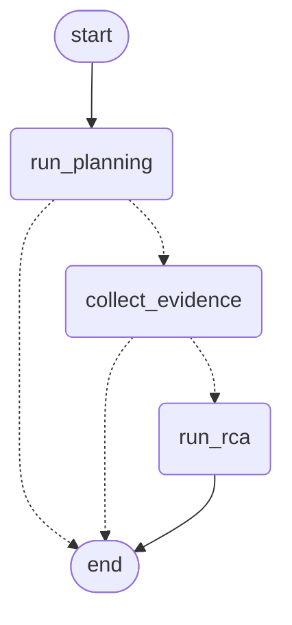

# End-to-End Orchestration: Planning → Evidence Collection → RCA

`POST /api/v1/incidents/investigate` runs the full pipeline — Section 1
(Planning), Sections 3-8 (Evidence Collection), and Section 9 (RCA) — in
one call. This is the as-built companion to
`docs/extension_02_end_to_end_orchestration_plan.md`, which was written
and agreed before any of this code existed; this doc records what was
actually decided and built.

## 1. The five decisions

| Decision | Choice |
| --- | --- |
| Response shape | **Option A** — nested `planning`/`evidence`/`rca`, one `OrchestrationResponse` |
| Latency model | **Synchronous** — one blocking HTTP call, no `202`/poll pattern |
| Endpoint | **New route** — `POST /api/v1/incidents/investigate`; every existing endpoint is untouched |
| Partial-evidence RCA | **Skip RCA only when there is *zero* evidence** — see section 2 |
| Graph location | **`agent/graph/orchestration_graph.py`**, separate from `planner_graph.py` |

## 2. Partial-evidence RCA: the architectural call

Two failure modes look similar but are not the same kind of problem:

- **Every evidence agent failed** — an infrastructure problem. There is
  nothing to reason over.
- **Evidence came back but looks unremarkable** — a real, valid RCA input.
  Deciding whether it's "enough" is exactly what the RCA system prompt
  already tells the model to do (`investigation_status = "INCONCLUSIVE"`
  when the evidence can't support a defensible root cause).

The orchestrator only ever short-circuits the first case
(`len(evidence.evidence) == 0` in `collect_evidence`, returning
`NO_EVIDENCE_COLLECTED` without ever calling RCA). It never tries to judge
whether evidence is "probably good enough" before the LLM sees it — that
would rebuild a second `EvidenceValidator`-shaped judgment outside the
model, which is exactly the design this pipeline (per
`reference/AIR-Investigation.pdf`) deliberately does not have. Any request
with at least one evidence item always reaches RCA; `INCONCLUSIVE` stays
entirely the model's call.

## 3. Request/response shape and the `IncidentInput` gap

`OrchestrationRequest` (`models/orchestration.py`) is not just
`IncidentInput`. Planning only needs the incident's own facts, but
Evidence Collection additionally needs a query time window and (for
`DeploymentAgent`) a repository — fields `IncidentInput` does not carry
and this service does not invent defaults for:

```python
class OrchestrationRequest(TimeWindowRequest):  # start_time, end_time
    incident: IncidentInput
    repository: ShortText | None = None
    branch: ShortText | None = None
    deployment_environment: ShortText | None = None
    namespace: ShortText | None = None
    cluster: ShortText | None = None
    pod: ShortText | None = None
```

`OrchestrationResponse` nests every stage's own existing response type
unchanged — no new duplicate schema for any of them:

```python
class OrchestrationResponse(BaseModel):
    investigation_id: UUID
    incident_id: UUID
    status: OrchestrationStatus
    terminal_reason: str | None = None
    planning: PlanningResponse           # always present
    evidence: InvestigateResponse | None  # absent if the pipeline stopped before this stage
    rca: InvestigationResult | None       # absent if the pipeline stopped before this stage
```

`investigation_id` is never invented here either: `PlanningApplication.plan()`
mints it (as it already does for `/api/v1/planning`), and every later
stage reuses that same ID — matching the guide's own convention that an
investigation's ID originates at Planning time.

## 4. The graph (`agent/graph/orchestration_graph.py`)



Three nodes, each calling one *existing, already-verified* service
unchanged (`PlanningApplication.plan`, `EvidenceInvestigator.investigate`,
`RcaService.investigate`) — this graph is pure orchestration, no new
business logic, matching Section 10's "thin LangGraph nodes" rule already
followed by `planner_graph.py`.

Both conditional routers share one shape:

```python
def route_after_planning(state: OrchestrationState) -> str:
    return END if "status" in state else "collect_evidence"

def route_after_evidence(state: OrchestrationState) -> str:
    return END if "status" in state else "run_rca"
```

A node stops the pipeline by setting `status` in the dict it returns, and
does nothing else different when it's continuing — so every router is the
same one-line check, no per-stage routing logic to keep in sync as more
terminal outcomes get added.

**The diagram above is also logged, not just documented.** The mermaid
text is emitted once per process at graph-compile time
(`logger.info("Orchestration graph compiled:\n%s", ...)`), guarded by a
module-level flag so it doesn't repeat on every request — the graph's
shape never changes between requests, so logging it once is enough to let
an operator see exactly what ran.

## 5. Node-level status logging

Every node logs its own start and completion, with the outer stage name
capitalized so it reads as a lifecycle event in the log stream (matching
what was asked for: "if Planning completed, write PLANNING is completed").
Captured verbatim from a real offline run:

```text
PLANNING started incident_id=...
PLANNING completed investigation_id=... status=PLAN_READY
EVIDENCE_COLLECTION started investigation_id=... agents=LogsAgent,MetricsAgent
EVIDENCE_COLLECTION completed investigation_id=... evidence_count=2 missing_agents=none
RCA started investigation_id=... evidence_count=2
RCA completed investigation_id=... status=COMPLETED overall_confidence=0.90
```

Every failure path logs just as explicitly, at `ERROR`, before the state
transition it explains (`PLANNING failed ... reason=...`,
`EVIDENCE_COLLECTION invalid ... reason=...`,
`EVIDENCE_COLLECTION produced no evidence ...`, `RCA failed ...`).

## 6. Mapping the plan onto an evidence request

`PlannerOutput.parallel_agents` is **free text** — an LLM output, never
validated against `AgentName`'s closed set (`LogsAgent`, `MetricsAgent`,
`TracesAgent`, `DeploymentAgent`). This is a real gap between what
Planning can say and what Evidence Collection can run, and it's handled
with the same failure-isolation philosophy already used inside
`EvidenceInvestigator` — applied one level up:

- **An unrecognized name mixed with valid ones** is dropped and logged
  (`EVIDENCE_COLLECTION dropping unrecognized agents ... dropped=...`);
  the rest of the plan still runs.
- **No recognized name at all** is `EVIDENCE_REQUEST_INVALID` /
  `NO_KNOWN_AGENTS_IN_PLAN` — there is nothing left to collect.
- **`DeploymentAgent` selected without a `repository`** in the request is
  `EVIDENCE_REQUEST_INVALID` / `DEPLOYMENT_AGENT_NEEDS_REPOSITORY` —
  caught via the same `InvestigateRequest` validator every other caller of
  `/api/v1/investigate` already goes through, not a new check.
- **`service_name`/`environment` missing from the incident** (both
  optional on `IncidentInput`, both required by `InvestigateRequest`) is
  `EVIDENCE_REQUEST_INVALID` / `MISSING_SERVICE_CONTEXT`.

`plan.required_evidence` maps directly to `InvestigateRequest.required_evidence`,
and `plan.hypotheses` maps to `InvestigateRequest.hypothesis_context` — the
two fields the Planner actually produces today.
`required_metrics`/`required_operations` (MetricsAgent/TracesAgent-specific)
have no analogous Planner output yet, so they're left at each agent's own
defaults; extending the Planner to populate them is future work, not
something this orchestrator should guess at.

## 7. Outcomes

| `status` | Meaning | HTTP |
| --- | --- | --- |
| `COMPLETED` | RCA ran and returned a completed investigation. | `200` |
| `INCONCLUSIVE` | RCA ran; the model could not establish a defensible root cause. Not an error. | `200` |
| `PLANNER_FAILED` | Planning did not produce a ready plan (`terminal_reason`: `MODEL_FAILURE` / `NO_AGENTS_SELECTED`). | `502` |
| `EVIDENCE_REQUEST_INVALID` | The plan and request together can't build a valid evidence request (`terminal_reason`: `NO_KNOWN_AGENTS_IN_PLAN` / `MISSING_SERVICE_CONTEXT` / `DEPLOYMENT_AGENT_NEEDS_REPOSITORY`). | `422` |
| `NO_EVIDENCE_COLLECTED` | Every selected evidence agent failed; RCA never ran (`terminal_reason`: `ALL_AGENTS_FAILED`). | `200` — matches `/api/v1/investigate`'s own precedent of returning `200` even when every agent is in `missing_agents` |
| `RCA_FAILED` | RCA's model failed after bounded retries (`terminal_reason`: `RCA_EXECUTION_FAILED`). | `502` |

## 8. Verified

- 10 new tests (`tests/test_orchestration_application.py`,
  `tests/test_orchestration_api.py`) cover every row in the table above,
  built from the same real offline stack used everywhere else in this
  suite (`OfflinePlanModel`, the four offline evidence tools,
  `OfflineInvestigationModel`) — never a mocked service.
- Full offline run confirmed end to end: `COMPLETED`, `PLANNER_FAILED`,
  `NO_EVIDENCE_COLLECTED`, `EVIDENCE_REQUEST_INVALID` (both the
  no-known-agent and missing-repository cases), and `RCA_FAILED`, each
  with the correct nested response shape and the correct log sequence.
- Confirmed live on a running server: `POST /api/v1/incidents/investigate`
  registered, and `OrchestrationResponse`'s OpenAPI schema lists exactly
  `investigation_id, incident_id, status, terminal_reason, planning,
  evidence, rca`.

## 9. Looking ahead: incident lifecycle, and scenario-driven evidence collection

Two things were explicitly flagged as future direction while this was
built, and shaped some choices here without building either yet:

- **Incident lifecycle state tracking** (`PLANNING`, `INVESTIGATION`,
  `AGENTS STATUS`, `KEY-FINDINGS`, `RCA`, `SUGGESTION`, persisted per
  investigation). `OrchestrationStatus`'s six values and the per-stage
  node-level logging in section 5 were both chosen to read naturally as
  lifecycle events already — but no persistence layer exists yet.
  `OrchestrationState` (`agent/graph/orchestration_state.py`) is exactly
  the shape a future persistence hook would read from at each node
  boundary, without needing to change the graph itself.
- **Multiple incident scenarios driving different evidence collection.**
  This already works today, structurally: which agents run
  (`plan.parallel_agents`) and what they're told to look for
  (`plan.required_evidence`, `plan.hypotheses`) both come from the
  Planner's own per-incident output, not anything hardcoded in the
  orchestrator. Section 6 documents where that mapping is currently
  incomplete (`required_metrics`/`required_operations`) — that's the
  concrete next step if new scenarios need finer per-agent control than
  `required_evidence` alone provides.
